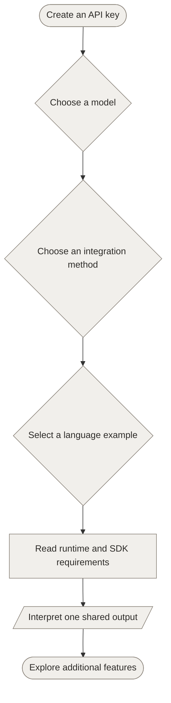
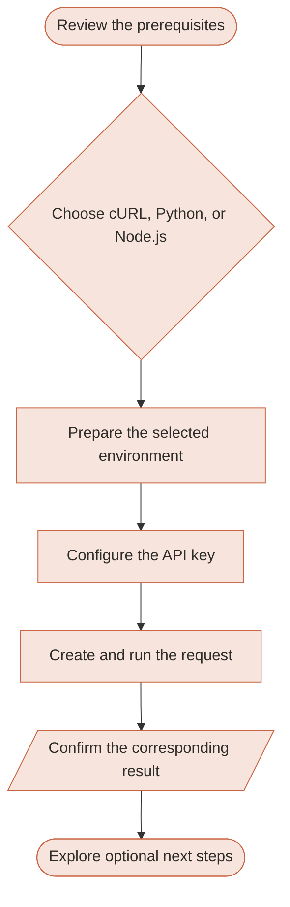

# Redesigning the Kimi API Quickstart

> An independent documentation redesign focused on helping developers make their first successful Kimi API request with less friction.

## 1. Project overview

The Kimi API enables developers to integrate Moonshot AI’s Kimi models into applications for text generation, visual understanding, and tool-enabled workflows.

The [original Kimi Quickstart](https://platform.kimi.ai/docs/overview) repeated information, placed important setup instructions after the code examples, and presented several model and integration choices before users completed their first request. It also provided limited guidance on preparing Python and Node.js environments.

I reordered the page, grouped each language’s setup instructions with its code, and moved optional choices until after the first request. My goal was to help users complete their first Kimi API call with cURL, Python, or Node.js in about ten minutes.

This is an independent documentation exercise and is not affiliated with Moonshot AI.

## 2. The problem

### 2.1 Users had to make too many choices before sending a request

Before making an API call, users were asked to compare several models and integration methods, including the Chat Completions API, Responses API, Messages API, and Playground.

These options are useful after the first request, but presenting them earlier forces users to compare products before they can try the API.

### 2.2 Setup instructions appeared after the code examples

The original page displayed the Python and Node.js examples before explaining the required runtime versions and SDK installation commands.

A user following the page from top to bottom could therefore reach the code without having prepared the environment required to run it.

### 2.3 Users had to assemble the Python and Node.js instructions themselves

The Python and Node.js code samples appeared in separate tabs, but their prerequisites and SDK installation commands were combined below all the examples.

Users had to move between the code tabs and the shared instructions to reconstruct the complete setup and execution sequence for their selected language.

### 2.4 The page introduced the Anthropic-compatible format but did not show how to use it

The introduction stated that Kimi supports both OpenAI- and Anthropic-compatible API formats. However, the first-call workflow only showed how to install and use the OpenAI SDK.

A user who selected the Anthropic-compatible format was not shown how to complete the same quickstart task.

### 2.5 The page did not show beginners how to prepare Python or Node.js

The Python and Node.js examples did not show users how to check their runtime version or prepare an isolated project environment.

This made the examples harder to follow for developers using an API or SDK for the first time.

### 2.6 Users could not easily match each request with its result

The page displayed one text output after all three examples. It did not show the JSON returned by the cURL request or place each result next to the example that produced it.

## 3. Key changes

### 3.1 Focused the page on one first request

The redesigned quickstart uses the Kimi K3 model and the OpenAI-compatible Chat Completions API throughout the examples.

The page now asks users to send one request before comparing other models and integration methods.

### 3.2 Created a complete workflow for each method

The cURL, Python, and Node.js tabs now contain the complete sequence for their respective methods, from setup to execution and expected output.

Users can select one tab and follow it without combining instructions from different parts of the page.

### 3.3 Moved setup before the code that depends on it

Each language path now tells users to check the runtime, prepare the project environment, install the SDK, and configure the API key before they create and run the example file.

The Python path explains how to create and activate a virtual environment. The Node.js path explains how to create and initialize a project directory.

### 3.4 Told users which API format the examples use

The introduction now tells users that the examples use the OpenAI-compatible Chat Completions API.

It sends users who need the Anthropic-compatible format to the Messages API reference instead of leaving them to expect an Anthropic SDK example later on the page.

### 3.5 Placed each result next to its request

Each method ends with its corresponding result.

The cURL path shows a shortened JSON response, while the Python and Node.js paths show the text printed by their example programs. The page also explains that generated content and request-specific values can vary.

### 3.6 Removed repetition and shortened the language

I revised unclear or unnatural sentences, removed repeated setup information, and shortened explanations that did not help users complete the first request.

Users can find links to models and additional features under **Next steps**, after they complete the first request.

## 4. Before and after

### 4.1 Before

### 4.2 After

## 5. AI-assisted writing and review workflow

Codex helped me:

- Draft an initial outline from my review notes.
- Suggest more concise English wording.
- Compare technical claims with Kimi’s official documentation and flag unsupported assumptions.
- Check the syntax of code examples.

I remained responsible for:

- Identifying problems in the original documentation.
- Deciding what users needed to do first and which information they needed to complete the request.
- Testing the cURL, Python, and Node.js requests against the Kimi API.
- Choosing the final page structure and wording.

Codex handled repeated searches and checks, while I verified the sources and approved every change.

## 6. Outcome

The redesigned quickstart takes users from preparing their environment to running a request and checking its result.

Each method now contains its own setup, request, execution, and output sequence. Users can still compare models and explore additional features after they complete the first request.
